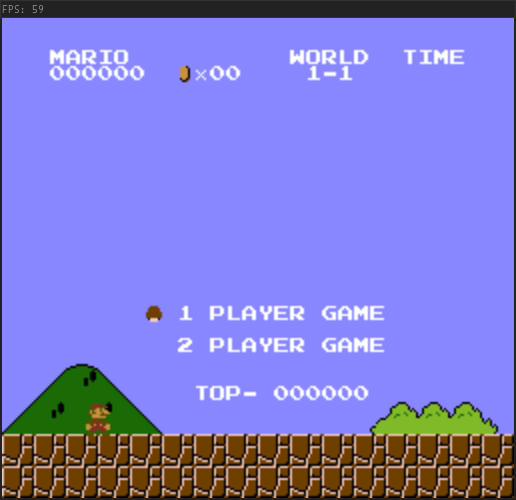

# NES Emulator

[](https://travis-ci.com/JMcKiern/NES-Emulator)
[](https://ci.appveyor.com/project/JMcKiern/nes-emulator)
[](https://scan.coverity.com/projects/jmckiern-nes-emulator)

NES emulator written in C++
<div align="center">

</div>

## How to Build

### Dependencies

Before building this project the following must be installed :
- [GLEW](http://glew.sourceforge.net/) - `libglew-dev` on Ubuntu
- [GLFW](https://www.glfw.org/download.html) - `libglfw3-dev` on Ubuntu
- [PortAudio](http://www.portaudio.com/) - `portaudio19-dev` on Ubuntu

### CMake

To keep this project platform independent CMake is used to generate the build files.

The following definitions can be used to locate the dependencies if they are not found automatically:
- CMAKE\_INCLUDE\_PATH
- CMAKE\_LIBRARY\_PATH

### Windows

I use [vcpkg](https://github.com/microsoft/vcpkg) to install the dependencies on Windows.

```
vcpkg install glfw3:x64_windows
vcpkg install glew:x64_windows
vcpkg install portaudio:x64_windows
git clone https://github.com/jmckiern/NES-Emulator
cd NES-Emulator
mkdir build
cd build
cmake -G"Visual Studio 15 2017 Win64" -DCMAKE_TOOLCHAIN_FILE=<path-to-vcpkg>/scripts/buildsystems/vcpkg.cmake ..
cmake --build . --target ALL_BUILD --config Release
```

### Linux

```
sudo apt install libglew-dev libglfw3-dev portaudio19-dev
git clone https://github.com/jmckiern/NES-Emulator
cd NES-Emulator
mkdir build
cd build
cmake ..
make
```

## How to Use

### Running the emulator

This emulator opens the file passed through the command line arguments. A game can also be dragged onto the executable.

### Controls

The controls can be set in a `settings.ini` file.

The default controls are

Player 1:
```
Directional Pad - WASD
Select - G
Start - H
A - K
B - J
```

Player 2:
```
Directional Pad - Arrow Keys
Select - Keypad 1
Start - Keypad 2
A - Keypad 3
B - Keypad 0
```

## Mappers supported

The mappers currently supported are NROM (0), MMC1 (1), UxROM (2), CNROM (3) and MMC3 (4).

Including only games released in the USA, this emulator supports [641](http://bootgod.dyndns.org:7777/search.php?region=USA&system=NTSC&ines_op=%3C%3D%60%40%60&ines=04) games.
